# La penúltima guía para iniciarte en Git, GitHub y GitLab

Me he animado a escribir este artículo a raíz de asistir, junto a otras compañeras de Adalab, a un taller sobre los beneficios de trabajar con control de versiones.
El taller se llamaba "La magia de Git y GitLab" y fue impartido por Elena Mateos López.

A todos nos viene a la cabeza ese momento en el que, en nuestro directorio, tenemos la versión 1ª, versión casi final, versión final, versión final revisada, etc. de nuestro proyecto, y ya no te cuento si el proyecto es de un equipo de varias personas. 😖😖

Los sistemas de control de versiones vienen a solventar esto y ayudar a organizarnos, ya que, registran los cambios realizados en un archivo o en un conjunto de archivos y evitan que perdamos información.

No he querido dejar de escribir sobre ninguna de las funcionalidades que vimos. Lo que se pretende con este artículo es hacer una introducción de una manera global, explicando los fundamentos de estos sistemas, para posteriormente crear un flujo de trabajo y una chuletilla de código.


## Intro: sistemas de control de versiones

Los sistemas de control de versiones son programas que tienen como finalidad llevar un seguimiento sobre los cambios y estados de un proyecto concreto. Esto supone una tarea fundamental, sobre todo si hablamos de trabajo en equipo.

Las grandes ventajas que de trabajar con ellos serían:
- Comparar el código de un archivo, de modo que podamos ver las diferencias entre versiones
- Restaurar versiones antiguas
- Fusionar cambios entre distintas versiones
- Trabajar con distintas ramas de un proyecto, por ejemplo la de producción y desarrollo.

Existen dos variantes principales:
- **Sistemas centralizados**: hay un servidor que mantiene el repositorio y cada programador mantiene en local únicamente aquellos archivos con los que está trabajando.
- **Sistemas distribuidos**:  En este tipo de sistemas cada uno de los integrantes del equipo mantiene una copia local del repositorio completo.

En definitiva, con estos sistemas podemos crear y mantener repositorios de software que conservan todos los estados por el que va pasando el desarrollo del proyecto, las personas que enviaron los cambios, las ramas de desarrollo que fueron actualizadas o fusionadas, etc.

El más popular de todos estos sistemas es, sin duda, [**Git**](https://git-scm.com/), sistema de código abierto, multiplataforma y además motor, tanto de GitHub como de GitLab.

## Sobre Git, GitHub y GitLab

**Git** es un sistema de control de versiones distribuido, multiplataforma, de código abierto y que ha conseguido universalizar este tipo de herramientas aumentando en gran medida la eficiencia de los desarrolladores.

Tanto [GitHub](https://github.com/), como [GitLab](https://gitlab.com) son plataformas creadas para facilitar el desarrollo colaborativo de software, basados en **Git** y que nos permiten alojar proyectos en la web gratuitamente, por lo general de forma pública, aunque podemos alojar los proyectos de modo privado, de manera gratuita para el caso de **GitLab** y pagando una pequeña suscripción mensual en el caso de **GitHub**.

## Prerrequisitos
1. Cuenta de correo electrónico
1. Comprobar si tenemos instalado **Git** y si se trata de la última versión. Abre la consola y escribe:
```sh
git --version
```
Si:
 - No tienes instalado Git: vete al paso 5 y 6 de este apartado.
 - Tienes instalada una version reciente: *"tira millas"*
 - Tienes instalada una version *"no tan reciente"* y quieres tener la última:

 ``` sh
 git clone https://github.com/git/git
```
    Puedes comprobar la última versión de Git [aquí](https://git-scm.com/downloads)
1. Crear una [cuenta](https://services.github.com/on-demand/intro-to-github/es/crear-cuenta-github) en GitLab.
1. Crear una [cuenta](https://gitlab.com/users/sign_in) en GitHub.
1. Instalar Git en tu máquina:

  -   **Linux**: Abre la terminal (Ctrl + t) y escribe:
 ```sh
 apt-get install git
 ```
  -  **MAC**: Instalador en este [enlace](http://git-scm.com/download/mac)
  - **Windows**:  Instalador en este [enlace](http://windows.github.com)
1. Configuración de Git:
 1. Añadimos nuestro nombre a la configuración de Git
 ```sh
git config --global user.name "Nuestro Nombre"
 ```
 1. Configuramos nuestro email para trabajar con Git
 ```sh
git config --global user.email "nuestromail@example.com"
 ```
 **Ojo**: Es importante que el email coincida con el que hemos utilizado en GitHub y GitLab, ya que se utilizará para comprobar nuestros credenciales a la hora de subir información a un repositorio remoto.
 1. Comprobamos que todo está correcto:
 ```sh
git config --list
 ```
 1. Configurar la consola para que almacene nuestras credenciales y así evitar el poner la contraseña cada vez que conectemos con el repositorio remoto.
    - [**Windows**](https://help.github.com/articles/caching-your-github-password-in-git/#platform-windows)
    - [**Mac**](https://help.github.com/articles/caching-your-github-password-in-git/#platform-mac)
     - [**Para todos**](https://help.github.com/articles/caching-your-github-password-in-git/#platform-linux)


## Conceptos y comandos en Git

Desde la consola podemos ejecutar **Git**, como cualquier otro programa. La única diferencia es que **Git** por defecto no tiene una interfaz gráfica.
Antes de meternos a describir algunos de los comandos más frecuentes de **Git**, vamos que aclarar algunos conceptos que tienen que ver con el estado de los archivos y que nos ayudarán a entender que pasa cuando los ejecutamos.

### Los estados en Git
Git tiene tres estados principales en los que se pueden encontrar tus archivos: confirmado (committed), modificado (modified), y preparado (staged). **Confirmado** significa que los datos están almacenados de manera segura en tu base de datos local. **Modificado** significa que  cuando hay una modificación en algún archivo el estado, Git nos indica que esa modificación ha sido detectada pero no está a salvo ya que todavía no se ha confirmado que se quieren guardar esos datos. **Preparado** significa que has marcado un archivo modificado en su versión actual para que vaya en tu próxima confirmación.

Esto nos lleva a las tres secciones principales de un proyecto de Git:
- **Git directory**: la parte más importante. Es lo que se copia cuando clonas un repositorio desde otro ordenador
- **Working directory**: donde trabajamos. Es algo así como, una copia de una versión del proyecto
- **Staging area**: sencillo archivo que almacena información acerca de lo que va a ir en tu próxima confirmación (commit).

### Concepto de ramas:
Las ramas son utilizadas para desarrollar funcionalidades aisladas unas de otras. La rama master es la rama principal o "por defecto" cuando creas un repositorio.

Lo que pasa cuando creamos una rama es que Git toma el estado en el que se encuentra el archivo y hace una derivación a otro espacio, de forma que se puede trabajar en él sin afectar al archivo inicial. Más adelante podemos juntarlos.

Las ramas nos pueden servir para muchos casos de uso y son muy útiles cuando se trabaja con equipos de varias personas, ya que, de esta manera no pisaremos el trabajo de nuestros compañeros. Un ejemplo sería la creación de una funcionalidad que queramos integrar en un programa y para la cual no queremos que la rama principal se vea afectada. Esta función experimental se puede realizar en una rama independiente, de modo que, aunque tardemos varios días o semanas en terminarla, no afecte a la producción del código que tenemos en la rama principal y que permanecerá estable.

Si en un momento dado el trabajo con una rama nos ha resultado interesante, útil y se encuentra estable, entonces podemos fusionar ramas para incorporar las modificaciones del proyecto en su rama principal. Lo más probable es que surjan conflictos.

### Ahora sí, los comandos:

Ahí van los más frecuentes:
- Vincular nuestro repositorio local, en el que tenemos en nuestro disco duro con el remoto (el de Github o GitLab). Se sincronizarán los cambios. ( Este comando sólo se hace una vez en la vida de un repositorio)
```sh
git clone <url_repositorio>
```
Ejemplo de uso:
```sh
git clone https://github.com/Geo-Developers/geosquad.git  (Http)
git clone git@github.com:Geo-Developers/geosquad.git (SSH)
```
- Crear un repositorio local (en tu disco duro):
```sh
git init
```
- Si no has clonado un repositorio ya existente y quieres conectar tu repositorio local a un repositorio remoto:
```sh
git remote add <nombre_para_remoto> <url>
```
- Ver los cambios o estado en que se encuentran los archivos (además de la rama en la que estamos).
```sh
git status
```
-Nos permite marcar (añadir al stage) uno o varios ficheros o directorios para que Git sepa que lo(s) queremos añadir a la siguiente versión.

 Archivo concreto:
```sh
git add <nombre_del_fichero.js> <carpeta2>
git add <carpeta3> <carpeta4>
git add <nomre_del_fichero.md>
```
 Shortcut para añadir todo al stage:
```sh
git add -A
```
- Indicar a GIT que para todos los ficheros que hayan sido añadidos (mediante add) guarde una copia en memoria (una "versión") y le añada el comentario indicado como recordatorio. Lo habitual es añadir un comentario sobre los cambios que se hicieron en esta nueva versión.
```sh
git commit -m"<comentarios_sobre_los_cambios>"
```
- Enviar los cambios desde nuestro repositorio local a nuestro repositorio remoto:
```sh
git push origin <master>/<nombre_de_la_rama>
```
- Mostrar el historial de las versiones del archivo:
```sh
git log
```
- Deshacer los cambios de un fichero y dejarlo como estaba commit que indiquemos con el código sha.
```sh
git checkout <codigo_sha>
```
*Si haces git log podrás ver un código numérico (código sha) que identifa ese commit en concreto*
-  Ver lo que ha cambiando en un fichero/directorio desde la última versión que guardamos (desde el último commit)
```sh
git diff
```
- Crear una rama:
```sh
git branch <nombre_rama>
```
- Cambiar a la rama:
```sh
git checkout <nombre_rama>
```
- "Truqui" para crear y moverte a la rama en una linea de código:
```sh
git checkout -b <nombre_rama>
```
- Fusionar o "mergear" ramas:
```sh
git merge <nombre_rama_que_quieres_fusionar_a_la_rama-en_la_que_trabajas>
```
- Borrar rama:
```sh
git branch -d <nombre_de_la_rama>
```
- Para actualizar tu repositorio local al commit más nuevo (fusionar cambios del repositorio remoto)
```sh
git pull origin <master>/<nombre_de_la_rama>
```

## Que se hace en GitHub

1. Crear un nuevo repositorio

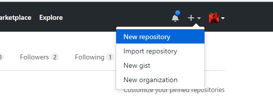

Es recomendable crear el repositorio incluyengo el README.md. Este archivo contiene la información sobre el contenido del repositorio.
Típicamente contienen una o más de estos temas:instrucciones de configuración, instrucciones de instalación, instrucciones de operación, información sobre la licencia
Información sobre el desarrollador, solución de problemas1, etc.

Es más recomendable todavia especificar el tipo de licencia que queremos darle.

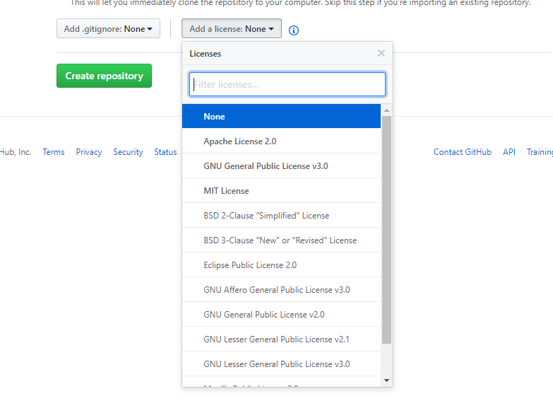

La url del repositorio podemos copiar de:

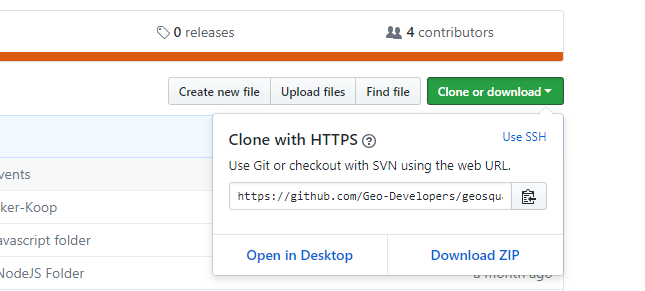

2. Hacer un **fork** de un repositorio de GitHub

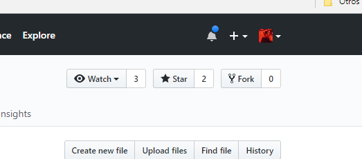

Algo así, como hacerse una copia del repositorio.

3. Crear una **Issue**: Un issue es una nota en un repositorio acerca de algo que necesita nuestra atención. Si encuentras un bug (error o problema en el código) en un proyecto que estás usando (y no sabes cómo resolverlo), tienes problemas con la documentación o tienes una pregunta, crea un issue. En GitHub puedes ponerles etiqueta, asignarlos a usuarios y hacer búsquedas. Se gestionan los issues desde GitHub.com.

 Pestaña **Issues** > **New Issue**

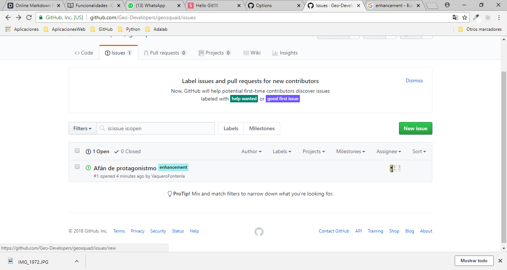

Con las issues se puede asignar una tarea a un colaborador de tu repositorio o proyecto, lo cual permite una mejor organización en proyectos que se pueden realizar desde casa siempre y cuando la organización tenga su repositorio en la nube. Estos issues tienen etiquetas, las cuales sirven para poder filtrar la búsqueda de estas y sirven precisamente para indicar la idea principal que esta tarea implica.

**Truco**: si queremos que un commit se asocie a un “issue” del repositorio podemos añadir el carácter “#” seguido del número de un issue del repositorio para que luego en Github aparezca asociado.

4. Publicar una página estática en la web utilizando **GitHub Pages**

Es imprescindible que tu proyecto tenga un **index.html**.
Vamos a las pestaña **Settings** > **Options** > **GitHub Pages** > **Seleccionar rama** > **Save**

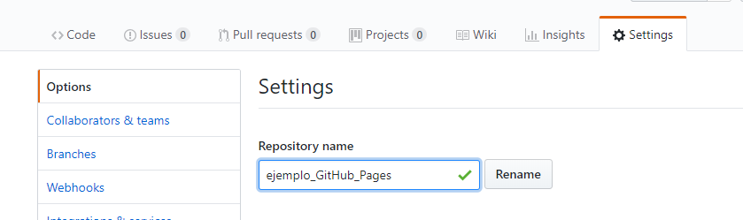

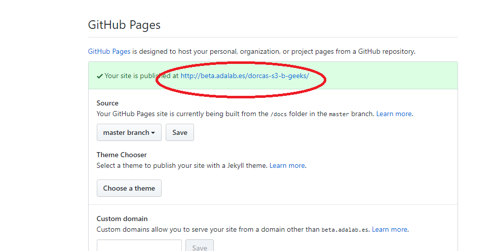

Se nos genera una **url** que alojarán nuestro proyecto.

5. **Pull request**

Cuando los usuarios realizan cambios en el código fuente y lo envían al repositorio, se les notifica a sus colaboradores para que analicen y revisen los cambios.
 1. Navega hasta la pestaña Pull Requests.
 1. Haz clic en New Pull Request.
 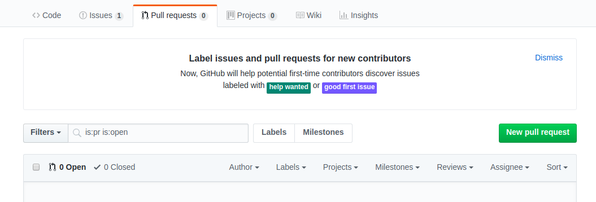
 1. En el desplegable base, selecciona master.
 1. En el desplegable compare, selecciona tu branch.
 1. Haz clic en Create pull request.
 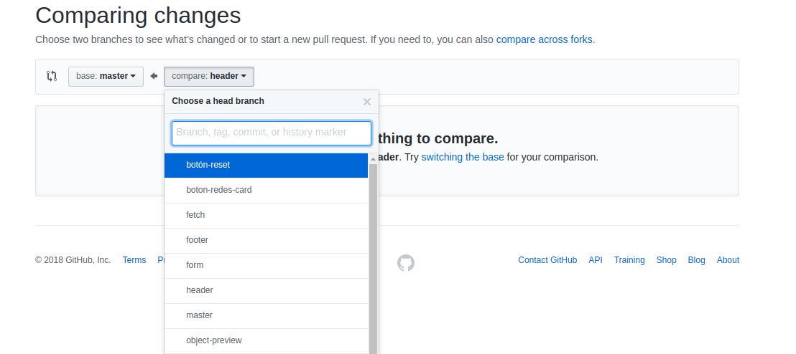
 1. Puedes dejar el título por defecto o hacerlo más descriptivo.
 1. Explicar el trabajo que has hecho en tu branch:
    - Resume el cambio propuesto.
    - Menciona al equipo de formadores usando @githubteacher.
    - Utiliza la palabra clave closes seguida inmediatamente por el número de tu issue (ej. closes #3) para indicar a qué Issue se refiere este Pull Request. Cuando haces esto, el issue se cerrará automáticamente cuando se haga merge del pull request.
  1. Nombrar revisores, añadir etiquetas, ..
  1. Haz clic en **Preview** para ver qué aspecto tendrá el Pull Request.
  1. Asígnate el pull request a ti mismo haciendo clic en assign to yourself en la sección Assignees.
  1. Haz clic en **Create pull request**.
   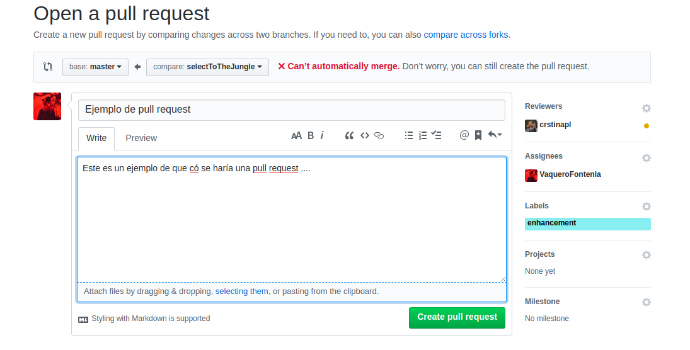
  1. En el caso de que todo esté bien y tus colaboradores aprueben tus cambios en el código, podrás fusionar tus cambiar a la rama base. Si no es así, te toca resolver los conflictos que puedan surgir.
  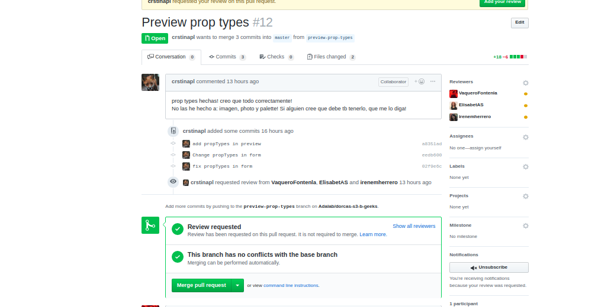


## Que se hace en GitLab

1. Crear un nuevo proyecto (lo mismo que crear un repositorio en GitHub)

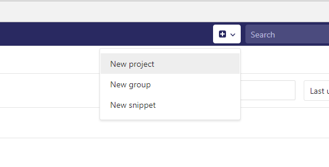

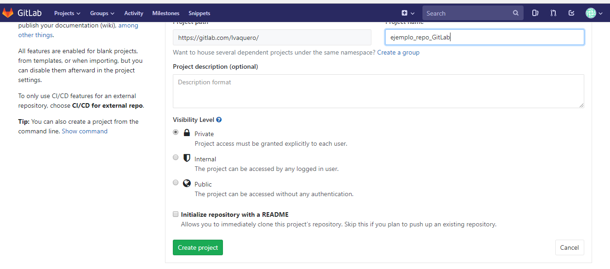

2.  Url del repositorio:

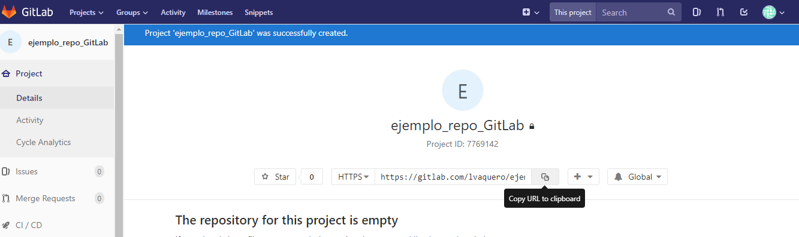


3. Podemos buscar proyectos en **Project** > **Explore projects**

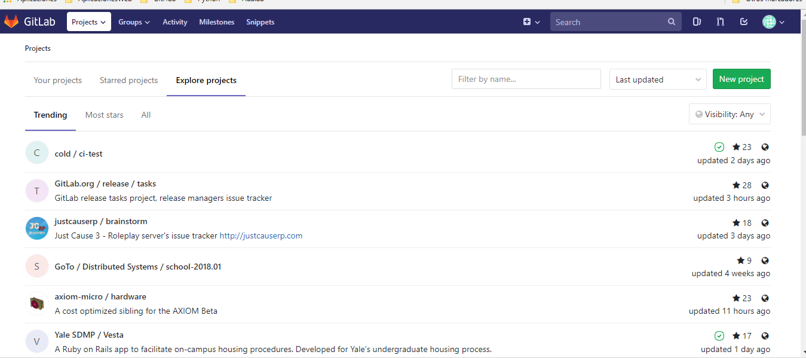

4. El tema de ** GitLab Pages** es un poco más complejo, pero Elena nos dió en el taller un par de vínculos para poder investigar:

 - [How to Publish a Website with GitLab Pages](https://www.youtube.com/watch?v=TWqh9MtT4Bg)
 - [How to Enable GitLab Pages for GitLab CE and EE](https://www.youtube.com/watch?v=dD8c7WNcc6s)

🤔🤔 GitLab tiene practicamente la misma funcionalidad que GitHub, así que, quizás sea redundante seguir con este apartado. Creo que la herramienta es bastante intuitiva, por lo que los mejor es que empecéis a trastear vosotros y no agotar con la lectura.

## Ahora si, al turrón !!
Vamos a exponer aquí un pequeño ejemplo para ver el flujo de trabajo que se tiene normalmente utilizando estas herramientas.

Reproducimos en el que hicimos con Elena en el taller:

Puedes encontrar todos los recursos en el [repositorio que se ha creado para este taller](https://github.com/ElenaMLopez/taller_git).

 1. Debes buscarte una pareja 😜😜
 1. Poneos de acuerdo en que repo vais a trabajar, si en el tuyo o el de tu compañer@.
 1. Da permiso a tu compañer@ en el repo para poder hacer commits.
 Pestaña **Settings** > **Collaborators & temas** > Buscar el usuario > **Add Collaborator**

 1. La persona a la que se le da permisos tiene que agregar un remoto en su reposotorio local. En la consola:
 ```sh
 git clone <url_repositorio>
 ```
 5. Ahora:
  1. Participante 01:
     1. Copia el código que encontrarás en el archivo test_1_index.html
     1. Pégalo en index.html
     1. Haz lo mismo para el archivo test_1_style.css
     1. Haz un commit y mira como se ve la página de tu repo local.
     1. Sube tu commit al repo remoto de GitHub.
  1. Participante 02:
       1. Copia el código que encontrarás en el archivo test_2_index.html
       1. Pégalo en index.html
       1. Haz lo mismo para el archivo test_2_style.css
       1. Haz un commit y mira como se ve la página de tu repo local.
       1. Sube tu commit al repo remoto de GitHub y ...
😱😨😱😨 No puedes hacerlo !!!
   1. Debes leer con atención lo que te dice la consola.
   1. Hacer un pull para fusionar los cambios del repositorio remoto.
   1. Vete a tu editor de código, busca los archivos en los que se genere un conflicto y ponte de acuerdo con tu compañer@ para resolverlos (ej. quedarse los cambios del Participante 02).

   1. Existe la opción de resolver estos conflictos directamente en GitHub o GitLab:
   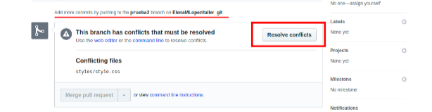

## Despedida y cierre

Como se ha visto los sistemas de control de versiones son muy útiles, ya que, nos permiten guardar un registro de las modificaciones que realizamos sobre un fichero a lo largo del tiempo.

Además de suministrar un histórico del proyecto, facilita mucho el trabajo en equipo y permite desarrollar varias versiones de un mismo programa a la vez.

Por mi parte, muchas gracias por ser unos valientes, y quedarse hasta el final de la lectura, ya que, el artículo es bastante denso, pero no he querido dejar de lado ninguna de las funcionalidades que vimos en este taller tan instructivo.

## Recursos

- [Curso de HTML5 desde cero](https://libro.cursohtml5desdecero.com/git_&_github.html)
- Curso gratuito [Try Git de CodeSchool](https://www.pluralsight.com/courses/how-git-works)
- Taller Git de [Elena Mateos](https://github.com/ElenaMLopez/taller_git)
- [Guía sencilla para empezar con GIt](http://rogerdudler.github.io/git-guide/index.es.html)
