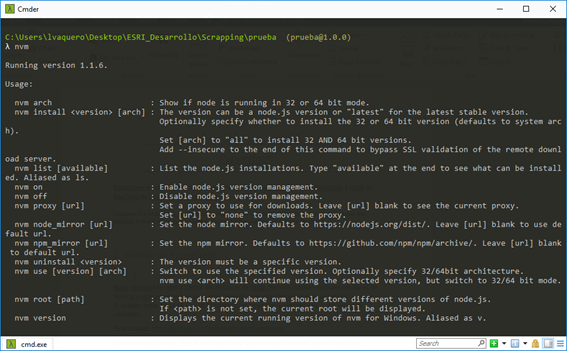
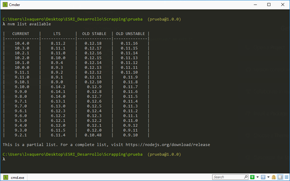
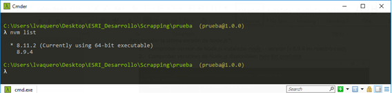
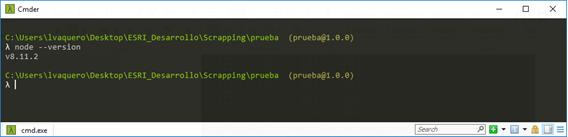
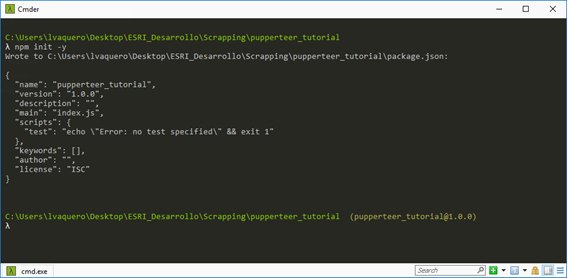
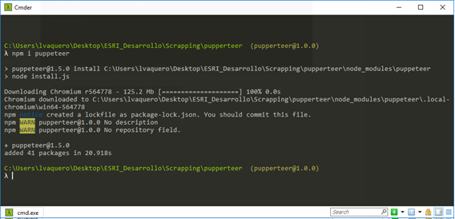

# Puppeteer for beginners

[Puppeteer](https://pptr.dev/) is the official tool for Chrome Headless by Google Chrome team.
It is a Node library which provides an API to control headless Chrome or Chromium over the DevTools Protocol. That means, we can execute everything that a browser does without a graphical interface.

A headless browser is a great tool for automated testing and server environments where you don't need a visible UI shell. For instance, you probably want to run some tests against a real web page, create a PDF of it, or just inspect how the browser renders an URL.

## Prerequisites

In this tutorial, we will use [λcmder](http://cmder.net/), which is a portable console emulator for **Windows**, as command line tool and [Atom](https://atom.io/) as code editor.

According to the Pupperteer documentation, the version of Node v6.4.0 is the basic requirement.
To verify we're installing the latest version.

## Installation
### nvm

These instructions are intended specifically for installing NVM (Node Version Manager) on **Windows**.

Node Version Manager allows to install multiple versions of Node.js and [npm](https://github.com/creationix/nvm) in the same environment, leaving each one completely isolated from the others. We can have Node v8.11 and v8.9 installed on our computer and run one or the other as needed.

For install **nvm**:
1. Go to the [download page](https://github.com/coreybutler/nvm-windows/releases).
1. Download the **nvm-setup.zip** option.
In our case, **nvm** is already installed, so we check which commands are available in command line:

```sh
$ nvm
```


Some useful commands:
 - **nvm install**: download and install a new version of Node.js
 - **nvm use**: to change from one version to another.
 - **nvm ls**: shows the versions installed in our environment.
 - **nvm list available**: shows the versions available for download.
(LTS: Long Term Support, name versions or special editions of software designed to have supports for a longer period than normal.)

For install **Node.js** :
1. Check installed node.js version:

```sh
$ node --version
```
2. Check available versions: the last version with durable support is the v8.11.2

```sh
$ nvm list available
```


3. Installation of the latest version of Node.js:

```sh
$ nvm install 8.11.2
```
4. Specify the installed version of Node to use:

```sh
$ nvm use 8.11.2
```
5. Verification:

```sh
$ nvm list ; node --version
```



### Getting Started  a Node.js Project

Workflow for a Node.js project creation:
1. Create a directory:

```sh
$ mkdir examples
```
2. To execute in the project:

```sh
$ npm init –y
```
 - [**npm**](https://github.com/npm/npm) ** * ** is the default package manager for the JavaScript runtime environment Node.js.
 - **npm init** : generates the *package.json* file.
 - **npm init -y**: generate the package.json file with default options (without asking any questions)
 - **[package.json](https://docs.npmjs.com/getting-started/using-a-package.json)** :
    - lists the packages that your project depends on.
    - allows you to specify the versions of a package that your project can use using semantic versioning rules.
    - makes your build reproducible, and therefore much easier to share with other developers.



3. Pupperteer installation:

```sh
$ npm i pupperteer
```



In the dependencies section of the package.jon file, we can check the installation.

## Application examples
### Print the User Agent
In computing, a user agent is software (a software agent) that is acting on behalf of a user. One common use of the term refers to a web browser telling a website information about the browser and operating system. This allows the website to customize content for the capabilities of a particular device.
1. In the code editor save file as, for example, *filename.js* (for example):
1. Code:

```js
 const puppeteer = require('puppeteer');

 (async() => {
   const browser = await puppeteer.launch();
   console.log(await browser.version());
   await browser.close();
 })();
```
An async function returns a Promise. When the promise is resolved, might return the result that you asked for. But to do this in a single line, you tie the call to async function with await.
3. Execute script on the command line:

```sh
$ node filename.js
```

### Generate screenshots and PDFs of pages
####	Screenshots:
1. In the code editor save file as, for example, *screenshots.js* (for example):
1. Code:

```js
const puppeteer = require('puppeteer');

puppeteer.launch().then(async browser => {
  const page = await browser.newPage();
  await page.goto('https://www.mondosonoro.com/')
  await page.screenshot({
    path: 'mondosonoro.png'
  });
  await browser.close();
});

```
  3. Execute script on the command line:

```sh
$ node screenshot.js
```
####	PDF files:
1. In the code editor save file as, for example, *pdf.js* (for example):
1. Code:

```js
const puppeteer = require('puppeteer');

(async () => {
  const browser = await puppeteer.launch();
  const page = await browser.newPage();
  await page.goto('http://www.laloterianavidad.com/pedrea/completa.html');
  await page.pdf({
    path: 'loreria.pdf',
    format: 'A4'
  });

  await browser.close();
})();

```
3. Execute script on the command line:

```sh
$ node pdf.js
```
### Get html on website
1. In the code editor save file as, for example, *html.js* (for example):
1. Code:

```js
const puppeteer = require('puppeteer');

puppeteer.launch().then(async browser => {
  const page = await browser.newPage();
  await page.goto('https://www.mondosonoro.com/')
  const html = await page.content();
  console.log(html);
});
```
3. Running the JavaScript file on the command line:

```sh
$ node html.js
```
### Evaluate script in the context of the page
Get the "viewport" of the page, as reported by the page.
1. In the code editor save file as, for example, *get-dimensions.js* (for example):
1. Code:

```js
const puppeteer = require('puppeteer');

(async () => {
  const browser = await puppeteer.launch();
  const page = await browser.newPage();
  await page.goto('https://www.esri.com/es-es/home');

  const dimensions = await page.evaluate(() => {
    return {
      width: document.documentElement.clientWidth,
      height: document.documentElement.clientHeight,
      deviceScaleFactor: window.devicePixelRatio
    };
  });

  console.log('Dimensions:', dimensions);

  await browser.close();
})();
```
3. Running the JavaScript file on the command line:

```sh
$ node get-dimensions.js
```

## Some explanations about Puppeteer workflow:
> - To import [*Puppeteer*](https://github.com/Geo-Developers/geosquad/blob/d2778ce2f968cc286e382c8c2ee60ef3d48fcb3d/NodeJS/PuppeteerForBeginners/examples/printUserAgent.js#L1).
> - The browser is created by calling the [*launch method*](https://github.com/Geo-Developers/geosquad/blob/d2778ce2f968cc286e382c8c2ee60ef3d48fcb3d/NodeJS/PuppeteerForBeginners/examples/screenshot.js#L4).
> - To navigate to a [*page*](https://github.com/Geo-Developers/geosquad/blob/d2778ce2f968cc286e382c8c2ee60ef3d48fcb3d/NodeJS/PuppeteerForBeginners/examples/html.js#L5).
> - To access to [*the content*](https://github.com/Geo-Developers/geosquad/blob/d2778ce2f968cc286e382c8c2ee60ef3d48fcb3d/NodeJS/PuppeteerForBeginners/examples/html.js#L6).
> - Or [*cookies*](https://github.com/Geo-Developers/geosquad/blob/a2a992f85d042b7dc80c9376d7e7a8a9ce78c7b5/NodeJS/PuppeteerForBeginners/examples/html.js#L7).

## Resources
- https://pptr.dev/
- https://github.com/creationix/nvm
- https://github.com/GoogleChrome/puppeteer
- https://www.youtube.com/watch?v=lhZOFUY1weo
- https://developers.google.com/web/updates/2017/04/headless-chrome
- https://medium.com/@e_mad_ehsan/getting-started-with-puppeteer-and-chrome-headless-for-web-scrapping-6bf5979dee3e

<hr>

** [* Node Package Manager](https://github.com/coreybutler/nvm-windows)** is a package manager for the JavaScript programming language. It is the default package manager for the JavaScript runtime environment Node.js. It consists of a command line client, also called npm, and an online database of public and paid-for private packages, called the npm registry. The registry is accessed via the client, and the available packages can be browsed and searched via the npm website.*
